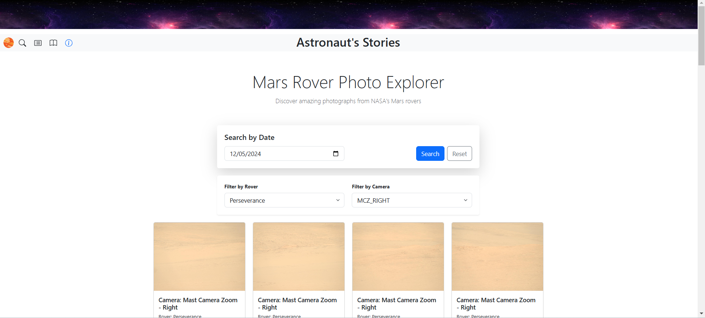
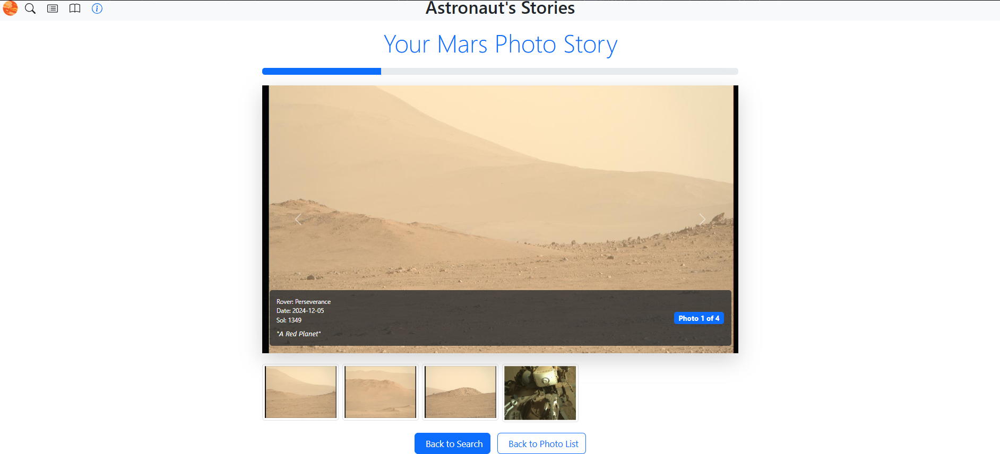

# Mars Rover Gallery

A dynamic web application that lets users explore and curate photos from NASA's Mars Rovers using the NASA Mars Rover Photos API.

## Features

- **Date-based Photo Search**: Search for Mars photos by Earth date across all rovers
- **Smart Date Handling**: Automatically finds the closest date with available photos
- **Dynamic Filtering**: Filter photos by rover and camera type
- **Photo Management**:
  - Save favorite photos to a personal collection
  - Add custom descriptions to saved photos
  - Remove photos from collection
  

- **Story Mode**: Create an animated slideshow of saved photos with:
  - Progress tracking
  - Thumbnail navigation
  - Photo descriptions and metadata display
  

## Technical Details

- Built with vanilla JavaScript using modular design pattern
- Responsive UI using Bootstrap 5
- NASA Mars Rover Photos API integration
- Dynamic DOM manipulation
- Error handling and loading states
- Custom event handling system

## Modules

- **UI**: Main application initialization and management
- **Search**: Handles API requests and date validation
- **DOM**: Manages UI updates and element manipulation
- **Photo List**: Handles saved photo collection
- **Story**: Creates and manages the photo slideshow feature

## Setup

1. Clone the repository
2. Replace `API_KEY` constant with your NASA API key
3. Serve the application using a local web server
4. Open in your browser

## Usage

1. Enter an Earth date to search for Mars photos
2. Filter results by rover and camera type if desired
3. Save interesting photos to your collection
4. Add descriptions to saved photos
5. Generate a slideshow story from your collection

## Dependencies

- Bootstrap 5 (CSS framework)
- NASA Mars Rover Photos API

## Performance Considerations

- Lazy loading for images
- Efficient DOM updates
- Error state handling
- Loading indicators for async operations

